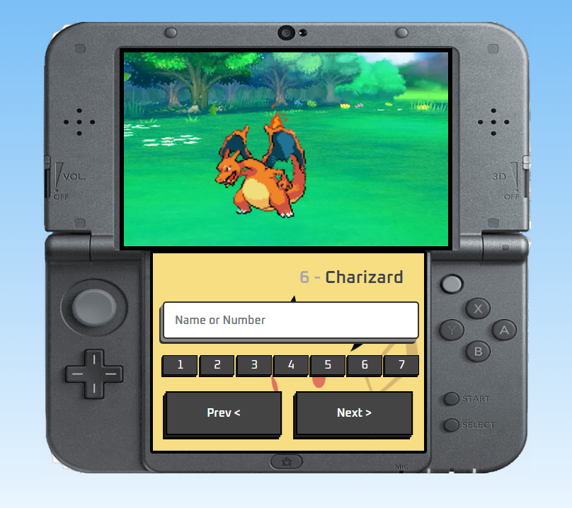

# Pokédex

Projeto "Pokédex" utilizando a PokéAPI.

## Screenshots

## Ferramentas Utilizadas

- HTML
- CSS
- JavaScript
- PokéAPI

## Funcionalidades
- Busca de qualquer pokémon da geração 1 a 7;
- Botões de 1 a 7, que possibilitam pular de uma geração a outra;
- Campo de pesquisa, podendo pesquisar pelo pokémon a partir de seu nome ou número.

## Feito por:

Lucas Kenji (dinozindev).
